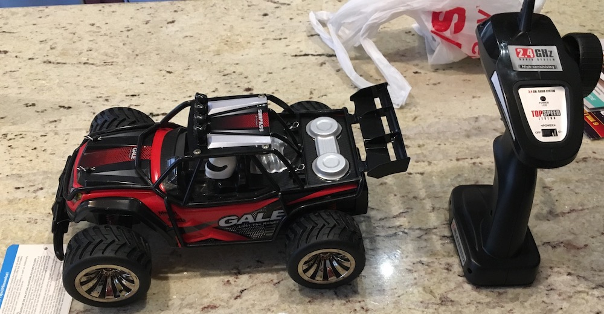
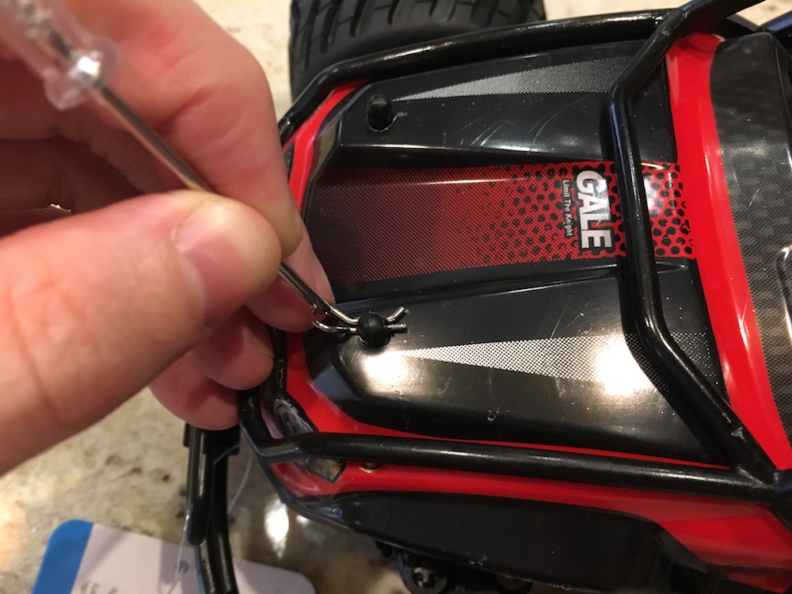
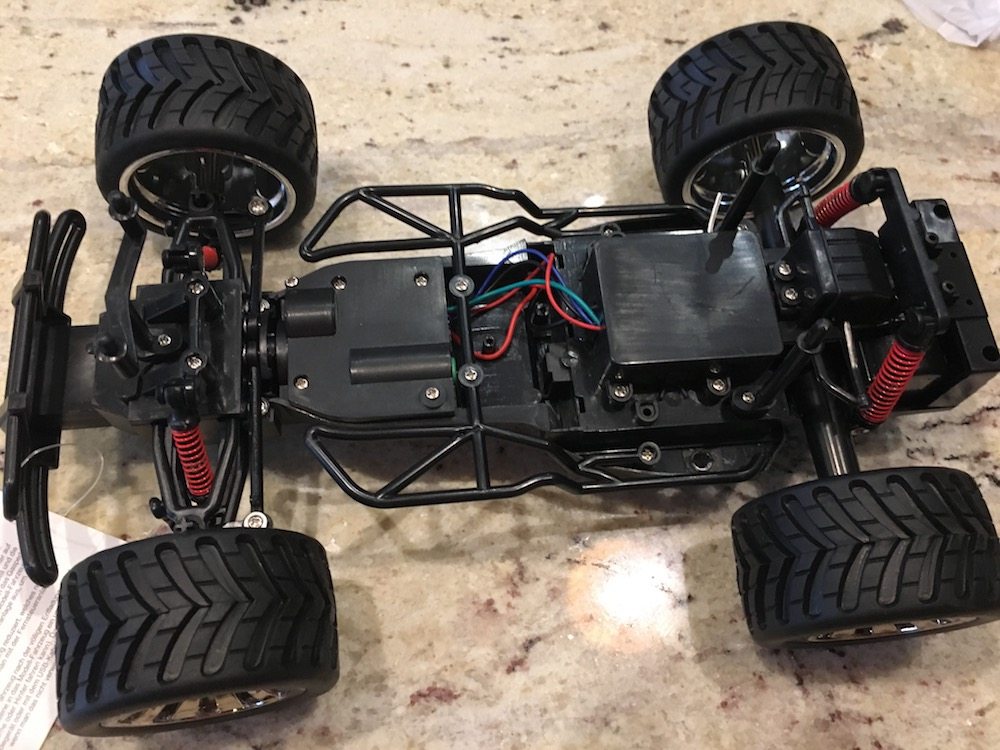
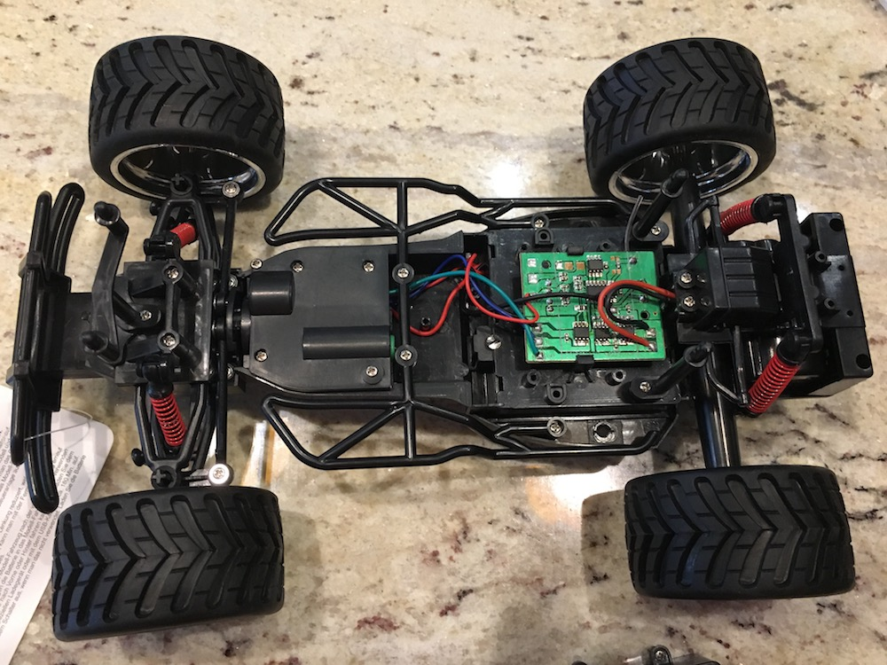
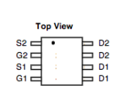
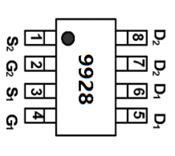
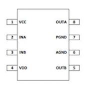
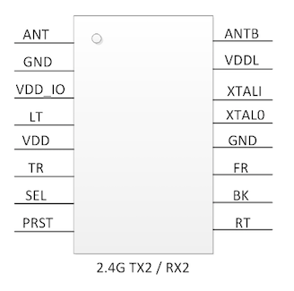
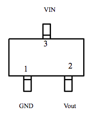
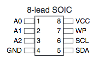

# 2.4Ghz RC Car Teardown

**TOQIBO Electric Racing Car Off Road 1/16 Scale 2.4Ghz 50M 2WD High Speed Desert Buggy Vehicle Radio Controlled Monster Truck Rock Crawler Toy Car, $39.99: [Amazon](https://www.amazon.com/gp/product/B071X95KBF)**

First step was to take it apart (after playing with it, of course!)

  

# Understanding the circuitry

The next step was to understand the circuit board - how does it convert the commands from the remote control into Left, Right, Forward, Reverse?

Specifically, I wanted to know:

- Which chip controls the decision to move or turn?
- Is there a separation between logic-level circuits and the motor circuits?  If so, what is the voltage?
- What is the best way to interface with it?

The big, unmarked chip in the middle was clearly important to understand.  There was no part number to look up though, so I started with the chips whose part numbers I could see first (Dark Blue, Brown, Pink, Red).

By looking at other teardowns of RC cars, I learned that the middle chip was probably called an RX2, (the remote has a sibling chip called TX2).  However, there are several versions of these chips, each with a different pinout, so I needed to make sure I had the right one.

Looking at the datasheets of the known parts, I started assigning pins to the mystery chip.  If a known part's pin was connected to the mystery chip pin, I had a good idea of what that pin was for.  Some leads (the large wires connected to the PCB) were connected to labeled pads, so I could see which pins on the mystery chip were connected to GND or R.

Here's what I found:
- There is a separation between the logic-level and dirve-level circuits.  Logic level runs at 3.3V, regulated from the battery
- Interfacing with RX2 chip is difficult.  Surface mount parts are difficult to sneak a lead on to.  But, using a [SOIC 16 chip clip](https://www.digikey.com/product-detail/en/pomona-electronics/5253/501-1661-ND/737207) does work.  You can find these cheaply on ebay.

## Pads ##
- **F** Forward
- **R** Reverse
- **4.8V** Batt +, Unswitched 4.8v
- **R** Direction of steering motor - Right
- **L** Direction of steering motor - Left
- **VDD**  Batt +, Same as 4.8V, but switched
- **GND**  Batt -

## Components ##

### [FNK4421 Dual P-Channel Mosfet (Dark Blue)](FNK4421.pdf)

- P1 S2 -> **4.8V**
- P2 G2 -> 4.8V via 10K resistor
- P3 S1 -> **4.8V**
- P4 G1 -> 4.8V via 10K resistor
- P5,P6 D1 -> **R**
- P7,P8 D2 -> **F**

### [FNK9928 N-Channel Mosfet (Brown)](FNK9928.pdf)

- P1 S2 -> GND, MC P11 via resistor
- P2 G2 -> MC P11
- P3 S1 -> MC P0 via 10K resistor
- P4 G1 -> MC P10
- P5,P6 D1 -> **F**
- P7,P8 D2 -> **R**

### [MX612 Motor Driver (Pink)](http://pdf.datasheetbank.com/datasheet-download/ETC/191016.pdf)

- P1 (VCC) Vout of 622K vreg, MC P?
- P2 (INA) -> MC P9
- P3 (INB) -> MC P4
- P4 (VDD) -> **4.8V**
- P8 (OUTA) -> **R**
- P7, P6 (PGND,AGND) are ganged, and probably go to GND
- P5 (OUTB) -> **L**

### [2.4Ghz RX2 (Yellow)](2_4GRX2.pdf)

- P01 ANT
- P02 GND
- P03 VDD_IO
- P04 LT
- P05 VDD (connected to VDD IO)
- P06 TR -> ROM SCL  (flip function? this makes no sense)
- P07 SEL -> ROM SDA (car channel selection. A - float, B - pull up, C - pull down)
- P08 PRST
- P09 RT
- P10 BK 9928 Mosfet -> **F**
- P11 FR 9928 Mosfet -> **R**
- P12 GND
- P13 XTAL1 OSC
- P14 XTAL0 OSC
- P15 VDDL
- P16 ANTB

### 662K 3.3V Regulator (Light Blue)

- P1 GND
- P2 Vout
- P3 Vin from **VDD** via 4.7k resistor

### [ATMEL Two-Wire Serial EEProm AT24C02B (Red)](AT24C02B.pdf)

Note: this is the first chip I found, and I thought that having a ROM on the board implied that the mystery chip was some kind of programmable microcontroller, but I don't think that is the case.  I'm not sure why this chip is here, it appears to be a red herring, or my datasheet is slighly out of spec.  It connects to the channel selection pin.  It is possible that this variant of the chip does have a channel sync feature.  This is alluded to in the car's manual.

  - P1 (A0), P2 (A1), P3 (A2), P4 (GND) tied to GND
  - P8 VCC P5
  - P7 WP is unconnected
  - P6 (SCL) -> MC P6
  - P5 (SDA) -> MC P7

